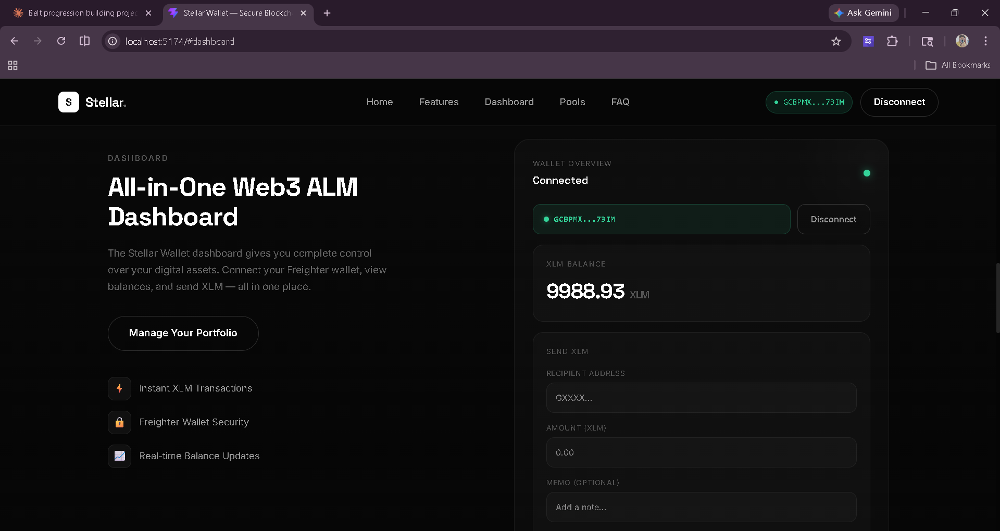
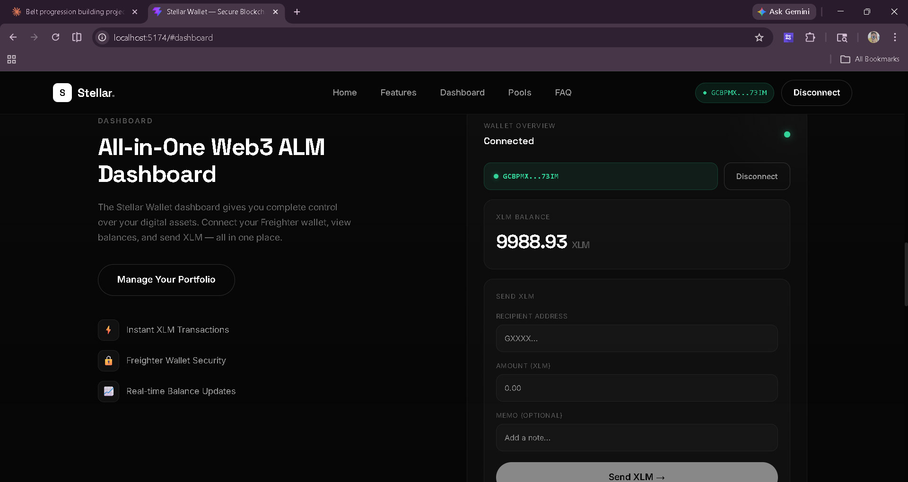
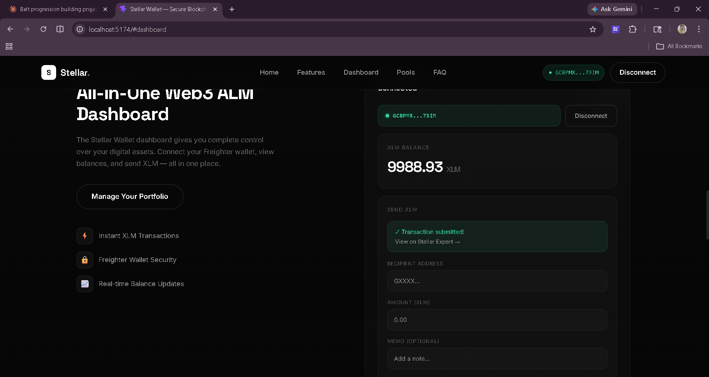
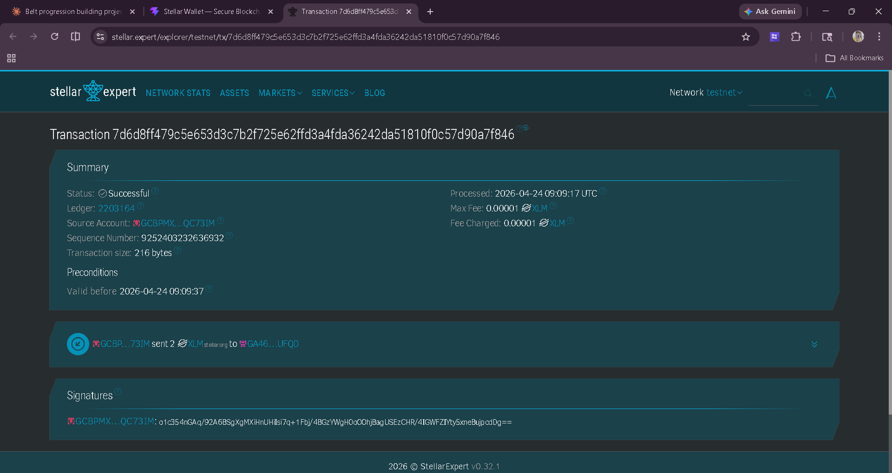

# Stellar Wallet dApp — Level 1 (White Belt)

## Description

A minimal Stellar dApp on Testnet. Connect Freighter wallet, view XLM balance, and send XLM transactions with a clean, terminal-inspired UI.

**Features:**
- ✅ Freighter wallet integration
- ✅ XLM balance fetching from Horizon
- ✅ Send XLM transactions
- ✅ Transaction hash verification on Stellar Expert
- ✅ Error handling and user feedback
- ✅ Dark terminal aesthetic with bright green accents
- ✅ Mobile responsive design

## Setup

### Prerequisites
1. **Freighter Wallet** — Install from [freighter.app](https://freighter.app)
2. **Node.js 18+** — Install from [nodejs.org](https://nodejs.org)
3. **pnpm** — Package manager (recommended)

### Installation

```bash
# 1. Clone the repository
git clone https://github.com/Aman0choudhary/stellar-belt-dapp.git
cd stellar-belt-dapp

# 2. Navigate to frontend
cd frontend

# 3. Install dependencies
pnpm install

# 4. Copy environment variables
cp .env.example .env
# Or create .env manually with contents from .env file

# 5. Start development server
pnpm dev
```

Visit `http://localhost:5173` in your browser.

## Configuration

### Freighter Setup
1. Install Freighter browser extension
2. Switch to **Testnet** in Freighter settings
3. Get test XLM from [Friendbot](https://friendbot.stellar.org/?addr=YOUR_ADDRESS)

### Environment Variables (.env)
```
VITE_STELLAR_NETWORK=TESTNET
VITE_STELLAR_RPC_URL=https://soroban-testnet.stellar.org
VITE_STELLAR_NETWORK_PASSPHRASE=Test SDF Network ; September 2015
VITE_HORIZON_URL=https://horizon-testnet.stellar.org
```

## Usage

1. **Connect Wallet** — Click "Connect Wallet" button
2. **Freighter Popup** — Approve connection in Freighter
3. **View Balance** — Your XLM balance appears automatically
4. **Send XLM** — Fill in recipient address, amount, and optional memo
5. **Confirm Transaction** — Sign in Freighter, watch for success/failure

## Project Structure

```
frontend/
├── src/
│   ├── components/
│   │   ├── WalletButton.tsx      # Connect/disconnect button
│   │   ├── BalanceDisplay.tsx    # XLM balance display with skeleton
│   │   └── SendForm.tsx          # Send XLM transaction form
│   ├── hooks/
│   │   ├── useWallet.ts          # Wallet connection state
│   │   └── useBalance.ts         # Balance fetching with loading
│   ├── lib/
│   │   ├── freighter.ts          # Freighter API wrapper
│   │   ├── balance.ts            # Horizon balance fetcher
│   │   └── transaction.ts        # XLM send transaction logic
│   ├── pages/
│   │   └── Home.tsx              # Main page composing components
│   ├── App.tsx                   # Root component
│   ├── main.tsx                  # Entry point
│   └── index.css                 # Tailwind global styles
├── vite.config.ts
├── tailwind.config.js
├── postcss.config.js
└── .env                          # Environment variables
```

## Deployment

### Deploy to Vercel

```bash
npm install -g vercel
cd frontend
vercel login
vercel --prod
```

Set these environment variables in Vercel dashboard:
- `VITE_STELLAR_NETWORK=TESTNET`
- `VITE_STELLAR_RPC_URL=https://soroban-testnet.stellar.org`
- `VITE_STELLAR_NETWORK_PASSPHRASE=Test SDF Network ; September 2015`
- `VITE_HORIZON_URL=https://horizon-testnet.stellar.org`

### Deploy to Netlify

```bash
pnpm build
# Drag and drop frontend/dist to app.netlify.com/drop
# Or: netlify deploy --prod --dir=dist
```

## Live Demo

- URL: https://stellar-belt-dapp.vercel.app/
- Status: Live and accessible

## Submission Screenshots

Add these 4 screenshots to the repo and keep these file names:
- `docs/screenshots/wallet-connected.png`
- `docs/screenshots/balance-displayed.png`
- `docs/screenshots/tx-success.png`
- `docs/screenshots/tx-feedback.png`

Then these README image links will render automatically:






## Troubleshooting

### "Freighter wallet not installed"
- Install Freighter from [freighter.app](https://freighter.app)
- Refresh the page after installing

### "Please switch Freighter to Testnet"
- Open Freighter wallet
- Click Settings (gear icon)
- Change Network to **Testnet**
- Refresh the page

### "Insufficient XLM balance"
- Get test XLM from [Friendbot](https://friendbot.stellar.org/?addr=YOUR_ADDRESS)
- Paste your wallet address and click the button
- Wait ~5 seconds for transaction to complete

### Transaction fails
- Check XLM balance (need at least 1 XLM for fees)
- Verify recipient address starts with "G"
- Check network status at [Stellar Status](https://stellar-status.pagerduty.com/)

## Explorer Links

- **Account Explorer**: https://stellar.expert/explorer/testnet/account/YOUR_ADDRESS
- **Transaction Explorer**: https://stellar.expert/explorer/testnet/tx/HASH
- **Horizon API**: https://developers.stellar.org/api

## Contributing

To contribute:
1. Create a feature branch (`git checkout -b feature/your-feature`)
2. Commit changes (`git commit -am 'feat: add your feature'`)
3. Push to branch (`git push origin feature/your-feature`)
4. Open a Pull Request

## Level 1 Submission Checklist

- [x] Public GitHub repository
- [x] README includes project description
- [x] README includes local setup instructions
- [x] Freighter wallet setup on Stellar Testnet
- [x] Wallet connect functionality implemented
- [x] Wallet disconnect functionality implemented
- [x] Balance fetch + clear UI display implemented
- [x] XLM transaction on testnet implemented
- [x] Transaction feedback implemented (success/failure + hash)
- [x] Development standards covered (UI, wallet, balance, transaction, errors)
- [x] Live deployed app URL added in the `Live Demo` section
- [x] Screenshot added: wallet connected state
- [x] Screenshot added: balance displayed
- [x] Screenshot added: successful testnet transaction
- [x] Screenshot added: transaction result shown to user
- [ ] Repository link submitted on Rise In before deadline

## License

MIT

## Resources

- [Stellar Documentation](https://developers.stellar.org)
- [Freighter Wallet API](https://docs.freighter.app)
- [Stellar SDK JS](https://github.com/stellar/stellar-sdk-js)
- [Horizon API Reference](https://developers.stellar.org/api/introduction/postman-networks/)
- [Stellar Testnet Info](https://developers.stellar.org/networks/testnet/)

---

**Next Level**: Level 2 (Yellow Belt) — Multi-wallet support + Soroban smart contracts
