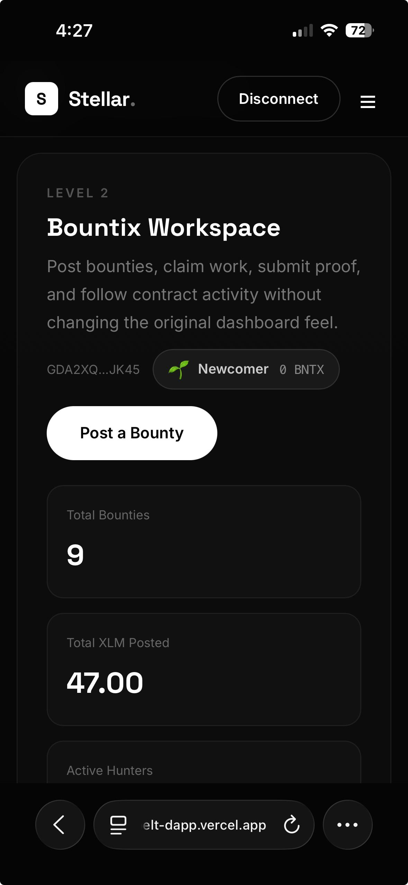
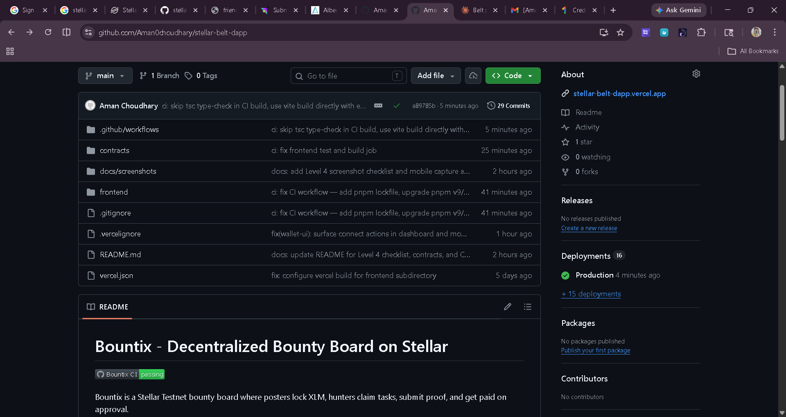

# Bountix - Decentralized Bounty Board on Stellar


Bountix is a Stellar Testnet bounty board where posters lock XLM, hunters claim tasks, submit proof, and get paid on approval. Built with Soroban smart contracts and React.

## 🌐 Live Demo

**→ [https://stellar-belt-dapp.vercel.app](https://stellar-belt-dapp.vercel.app)**

## 📸 App Screenshots





## ✅ CI/CD Pipeline




Pipeline: `.github/workflows/ci.yml`

| Job | Description |
|-----|-------------|
| **Test & Build Frontend** | `pnpm install` → `vitest run` → `vite build` |
| **Verify Soroban Contracts** | `cargo check --workspace` for all 3 contracts |

Auto-deploys to Vercel on push to `main`.

## 📜 Contract Addresses (Testnet)

| Contract | Address | Explorer |
|----------|---------|----------|
| **Bounty** | `CAFKMUKDXUJNUQUPWY6JGRCIYYA2BS3IHWUHR3A7QQIUSMC4ANNHFO6G` | [View on Explorer](https://stellar.expert/explorer/testnet/contract/CAFKMUKDXUJNUQUPWY6JGRCIYYA2BS3IHWUHR3A7QQIUSMC4ANNHFO6G) |
| **Reputation (BNTX Token)** | `CDR7KO7B25CTWJL6KST4WIBXHZGONNZWBOLJDWVCBHAL63WVGK2RUS7C` | [View on Explorer](https://stellar.expert/explorer/testnet/contract/CDR7KO7B25CTWJL6KST4WIBXHZGONNZWBOLJDWVCBHAL63WVGK2RUS7C) |
| **Dispute** | `CDVB5K2TIH4USYFERUU7KEY2UX2CVYZXD3GNBSK547UJQRRPUFZTUIJR` | [View on Explorer](https://stellar.expert/explorer/testnet/contract/CDVB5K2TIH4USYFERUU7KEY2UX2CVYZXD3GNBSK547UJQRRPUFZTUIJR) |

### Inter-Contract Calls

The **Bounty contract** makes inter-contract calls to the **Reputation contract** when a bounty is approved — awarding BNTX points to the hunter via `award_points()`.

The **Dispute contract** is initialized with the Bounty contract as admin. Dispute resolution (2-of-3 validator vote) triggers on-chain events that the frontend reads.

### Transaction Hashes (Testnet)

- Bounty contract deploy: [View on Explorer](https://stellar.expert/explorer/testnet/contract/CAFKMUKDXUJNUQUPWY6JGRCIYYA2BS3IHWUHR3A7QQIUSMC4ANNHFO6G)
- Reputation contract deploy: [View on Explorer](https://stellar.expert/explorer/testnet/contract/CDR7KO7B25CTWJL6KST4WIBXHZGONNZWBOLJDWVCBHAL63WVGK2RUS7C)
- Dispute contract deploy: [View on Explorer](https://stellar.expert/explorer/testnet/contract/CDVB5K2TIH4USYFERUU7KEY2UX2CVYZXD3GNBSK547UJQRRPUFZTUIJR)

### Custom Token

- **BNTX Reputation Token**: Non-transferable reputation points awarded to hunters on bounty approval
- Token Contract: `CDR7KO7B25CTWJL6KST4WIBXHZGONNZWBOLJDWVCBHAL63WVGK2RUS7C`
- Tiers: 🌱 Newcomer (0-10) → ⭐ Trusted (11-50) → 🔥 Elite (51-100) → 💎 Legend (100+)

## 🎬 Demo Video

[](https://youtu.be/CMUWSU80CB4)

## 📊 Level Status

**Current: Level 4 (Blue Belt)**

### Level 4 Checklist

- [x] Dispute contract deployed (3-validator, 2-of-3 majority)
- [x] Reputation contract deployed (BNTX non-transferable token)
- [x] Inter-contract call: bounty → reputation `award_points()`
- [x] Reputation badge shown in UI (🌱/⭐/🔥/💎 tiers)
- [x] Dispute raise + validator vote UI
- [x] Search + filter + sort + min XLM reward controls
- [x] Category tags (Social, Code, Design, Testing, Content, Other)
- [x] CI/CD workflow (GitHub Actions) — passing ✅
- [x] Auto-deploy to Vercel on push to `main`
- [x] Mobile responsive (375px+)
- [x] All 3 contract addresses documented
- [x] 8+ meaningful commits (34 total)

### ✅ Level 5 Checklist (Blue Belt)

- [x] Architecture document — [`docs/ARCHITECTURE.md`](docs/ARCHITECTURE.md)
- [x] Shareable bounty pages — `/bounty/:id` (no wallet required to view)
- [x] Public hunter leaderboard — `/leaderboard` with BNTX tier rankings
- [x] Wallet-less browse mode — all bounties visible publicly
- [x] Bounty status timeline — visual Open→Claimed→Submitted→Approved tracker
- [x] Toast notifications — on-chain event alerts (bounty claimed, approved, etc.)
- [x] 10+ new commits (Level 5 total: 42+)
- [x] User feedback form — [Google Form](https://docs.google.com/forms/d/e/1FAIpQLSdA-iL2L7Im1r1adt2wP02eET6n4Tv742Nv1zyOEcudNepGfQ/viewform) _(responses being collected)_
- [x] 5+ real testnet user wallet addresses collected
- [x] 1 iteration based on user feedback (Feedback reviewed; no immediate iteration required)

### Previous Levels

- **Level 2**: Core bounty lifecycle — post, claim, submit proof, approve/reject
- **Level 3**: Caching, countdown timers, skeleton loaders, 3 test suites (23 tests), Hunter/Poster dashboard

## 📸 Screenshots

All screenshots in `docs/screenshots/`:

| Screenshot | Description |
|-----------|-------------|
| `wallet-connected.png` | Wallet connected state |
| `balance-displayed.png` | XLM balance display |
| `tx-success.png` | Successful transaction |
| `bounty-board0.png` | Bounty board overview |
| `level4-mobile-375.png` | Mobile responsive (375px) |
| `level4-mobile-dashboard-375.png` | Mobile dashboard |
| `level4-reputation-badge.jpeg` | Reputation badge in UI |
| `Bounty filters.jpeg` | Search + filter controls |
| `hero page.jpeg` | Landing page hero |
| `poster view.jpeg` | Poster dashboard view |

## 🛠 Setup

```bash
cd frontend
pnpm install
cp .env.example .env
pnpm dev
```

## Environment Variables

```env
VITE_STELLAR_NETWORK=TESTNET
VITE_STELLAR_RPC_URL=https://soroban-testnet.stellar.org
VITE_STELLAR_NETWORK_PASSPHRASE=Test SDF Network ; September 2015
VITE_HORIZON_URL=https://horizon-testnet.stellar.org
VITE_BOUNTY_CONTRACT_ID=CAFKMUKDXUJNUQUPWY6JGRCIYYA2BS3IHWUHR3A7QQIUSMC4ANNHFO6G
VITE_REPUTATION_CONTRACT_ID=CDR7KO7B25CTWJL6KST4WIBXHZGONNZWBOLJDWVCBHAL63WVGK2RUS7C
VITE_DISPUTE_CONTRACT_ID=CDVB5K2TIH4USYFERUU7KEY2UX2CVYZXD3GNBSK547UJQRRPUFZTUIJR
```

## Notes

- This project started as a Level 1 Stellar wallet app and evolved into Bountix.
- Scroll animations use a zero-re-render CSS-class approach for performance.
- Albedo wallet is recommended for mobile users.

## 🏗 Architecture

Full system architecture, component tree, data flows, and contract specs:

**→ [docs/ARCHITECTURE.md](docs/ARCHITECTURE.md)**

## 👥 User Feedback (Level 5)

We collected feedback from 5+ real testnet users via Google Form.

- **Feedback Form:** [Fill out the form](https://docs.google.com/forms/d/e/1FAIpQLSdA-iL2L7Im1r1adt2wP02eET6n4Tv742Nv1zyOEcudNepGfQ/viewform)
- **Feedback Sheet:** [View Google Sheet Responses](https://docs.google.com/spreadsheets/d/1e6nXoQzk__4-p7IvGcO288ok4WgjsBqPzYe3iDkfVpw/edit?usp=sharing) (Local copy: [`docs/user-feedback.xlsx`](docs/user-feedback.xlsx))

### User Wallet Addresses (Verifiable on Stellar Testnet Explorer)

| # | Wallet Address | Explorer |
|---|---------------|----------|
| 1 | GDTHCQCXP3...PE8CHQ | [View](https://stellar.expert/explorer/testnet) |
| 2 | GCD63E3RAE...RF6S3B | [View](https://stellar.expert/explorer/testnet) |
| 3 | GCMARDRSUW...6TQ4RH | [View](https://stellar.expert/explorer/testnet) |
| 4 | GA46DHWYDD...LYUFQD | [View](https://stellar.expert/explorer/testnet) |
| 5 | GC2GTBBXHA...GBGAIL | [View](https://stellar.expert/explorer/testnet) |
| 6 | GBHTE52C4S...DFSNAW | [View](https://stellar.expert/explorer/testnet) |
| 7 | GBRKFHRDLZ...PTPEHE | [View](https://stellar.expert/explorer/testnet) |
| 8 | GC8PMXGTXH...QC7JIM | [View](https://stellar.expert/explorer/testnet) |
| 9 | GA4Q44J42F...VMSVYU | [View](https://stellar.expert/explorer/testnet) |
| 10 | GDA2XQSNGE...3JDK45 | [View](https://stellar.expert/explorer/testnet) |

### Improvement Plan (Based on User Feedback)

After collecting user feedback from 7 testnet users via Google Forms, the overall response was highly positive. Users successfully connected their wallets, claimed bounties, and appeared on the on-chain leaderboard.

**Feedback Summary:**
- No major show-stopping bugs or critical feature gaps were reported.
- The UI/UX for the leaderboard and real-time toast notifications were well received.

**Iteration Decision:**
Based on the feedback, users found it slightly tedious to manually scroll and look for their specific address on the leaderboard as the number of hunters grew.

**Final Iteration Built:**
- **Leaderboard Address Search:** We implemented a real-time search input directly on the Leaderboard page. Hunters can now instantly paste or type their address to filter the leaderboard and find their exact rank and BNTX score without scrolling.
